# Memoria de Prácticas: Desarrollo Web (HTML5 y CSS3)

Práctica P1 – Smart Room · Servicios Telemáticos · Universidad de Alcalá

---

## Apartado 2: Validación de la temperatura

El enunciado pide comprobar que la temperatura máxima sea mayor o igual que la mínima combinando restricciones HTML con una comprobación en JavaScript. La solución tiene dos niveles que se complementan.

**1. Restricciones HTML (nivel declarativo).** Los dos campos de alerta son `<input type="number">` con los atributos `min="-20"`, `max="45"` y `step="1"`. Con ellos, el navegador comprueba por sí solo, al enviar el formulario, que el valor sea numérico, esté entre −20 °C y 45 °C y sea un número entero. Estas restricciones no pueden comparar un campo con otro, y por eso hace falta el segundo nivel.

**2. Comprobación en JavaScript (nivel dinámico).** Se ha implementado un script que escucha el evento `input` de ambos campos. En cada cambio limpia el mensaje de validez anterior con `setCustomValidity("")`, lee los dos valores y actúa según el caso:

- **Falta alguno de los dos valores:** el resultado se vacía.
- **Alguno está fuera del rango de −20 °C a 45 °C:** el elemento `<output>` muestra el mensaje «Error: las temperaturas deben estar entre -20 y 45 grados C.». Además, el navegador marca el campo como inválido por los atributos `min` y `max`, y la hoja de estilos lo pinta en rojo.
- **El máximo es inferior al mínimo:** se ejecuta `inputMax.setCustomValidity("La Tº maxima debe ser mayor o igual a la minima.")` y el `<output>` muestra «Error: la temperatura maxima debe ser mayor o igual que la minima.». Con un mensaje de validez personalizado, el campo pasa a ser inválido: el navegador bloquea el envío del formulario y muestra ese texto como aviso nativo, y la hoja de estilos marca el campo en rojo.
- **Los valores son correctos:** el `<output>` muestra la diferencia entre ambas temperaturas (por ejemplo, «15 grados C»).

De este modo, el usuario ve un mensaje comprensible en pantalla en cuanto introduce un valor no válido, sin esperar a pulsar el botón de enviar.

*Nota:* se trata de una validación en el lado del cliente, orientada a mejorar la experiencia de usuario. Por seguridad, siempre debe complementarse con una validación en el servidor.

---

## Apartado 4: Control de caché (cabeceras HTTP)

### 4.1 Diferencia entre `no-cache` y `no-store`

- **`no-cache`**: el navegador **puede almacenar** el recurso en su caché local, pero está obligado a validarlo con el servidor antes de usarlo (mediante validadores como `ETag` o `Last-Modified`). Si el archivo no ha cambiado, el servidor responde `304 Not Modified` sin enviar el contenido y el navegador usa su copia; si ha cambiado, responde `200` con el contenido nuevo.
- **`no-store`**: es la directiva más restrictiva. Prohíbe al navegador y a cualquier caché intermedia **guardar** el recurso en ningún momento. Es útil para páginas que manejan datos confidenciales (por ejemplo, información bancaria).

En resumen: `no-cache` significa «guárdalo, pero pregunta antes de usarlo», y `no-store` significa «no lo guardes».

### 4.2 Política elegida para el documento HTML principal

Para `index.html` se elige `Cache-Control: no-cache`. Es el punto de entrada de la aplicación y su contenido cambia cada vez que se actualiza la web, además de ser el documento que enlaza la hoja de estilos y los scripts. Si se almacenara durante mucho tiempo, los usuarios seguirían viendo una versión antigua. Con `no-cache` el navegador comprueba en cada visita si ha cambiado y, si no es así, recibe una respuesta `304` muy ligera. No es necesario `no-store`, porque la página no contiene información confidencial.

### 4.3 Configuración en Apache

Se activa el módulo de cabeceras con `sudo a2enmod headers` y se añade lo siguiente al fichero del host virtual (`/etc/apache2/sites-available/iroom.conf`, cuyo directorio raíz es `/var/www/iroom`):

```apache
<Directory /var/www/iroom>
    Require all granted
    <FilesMatch "\.html$">
        Header set Cache-Control "no-cache"
    </FilesMatch>
</Directory>
```

Después se recarga la configuración con `sudo service apache2 reload`. La directiva solo afecta a los archivos `.html`; la hoja de estilos y la imagen conservan el comportamiento de caché por defecto.

### 4.4 Cabeceras observadas y comparación antes y después

Se ha cargado `http://192.168.37.131/index.html` con la pestaña **Network** de las herramientas de desarrollo de Microsoft Edge abierta, primero sin la directiva `Cache-Control` y después con ella. En cada caso se han probado tres acciones: navegar a la URL (Enter en la barra de direcciones), recarga normal (F5) y recarga forzada (Ctrl + F5).

| Situación | Cabeceras de respuesta observadas | Código HTTP | Comportamiento observado |
| :--- | :--- | :--- | :--- |
| Antes · navegación | Sin `Cache-Control`; con `ETag` y `Last-Modified` | 200 (from disk cache) | El navegador usa su copia local sin consultar al servidor: 0 B transferidos. |
| Antes · recarga normal | Sin `Cache-Control`; con `ETag` y `Last-Modified` | 200 | La petición lleva `Cache-Control: max-age=0`. Se transfieren 4,9 kB en total. |
| Antes · recarga forzada | Sin `Cache-Control`; con `ETag` y `Last-Modified` | 200 | La petición lleva `Cache-Control: no-cache`. Se descargan de nuevo todos los recursos (277 kB). |
| Después · navegación | `Cache-Control: no-cache`; con `ETag` y `Last-Modified` | 200 | El navegador ya no sirve el HTML desde la caché: lo pide al servidor (1,1 kB). |
| Después · recarga normal | `Cache-Control: no-cache`; con `ETag` y `Last-Modified` | 200 | La petición lleva `Cache-Control: max-age=0`. Se transfieren 1,1 kB. |
| Después · recarga forzada | No visible en la captura (vista de lista) | 200 | Se descargan de nuevo todos los recursos (277 kB). |

**Conclusión.** La diferencia importante está en la navegación normal. Antes de aplicar la configuración, el navegador servía `index.html` desde la caché del disco sin preguntar al servidor, de modo que el usuario podía ver una versión antigua. Con `Cache-Control: no-cache`, el navegador consulta al servidor en cada visita. En esa petición envía la cabecera `If-None-Match` con el valor del `ETag` recibido anteriormente (`"6a9-65d3dc8fe88dc-gzip"`), es decir, valida el documento antes de usarlo, tal como describe el apartado 4.1. Mientras tanto, `iroom.css` y `habitacion.jpg` se siguen sirviendo desde la caché de memoria (0 B), porque la directiva solo se aplica a los `.html`.

*Observación:* en las pruebas posteriores el servidor respondió `200` con el contenido (1,1 kB) y no `304 Not Modified`, aunque el documento no había cambiado. El ETag lleva el sufijo `-gzip` porque Apache comprime la respuesta, y es posible que esto influya en la comparación. No se ha investigado más; el comportamiento sigue cumpliendo el objetivo de que el navegador valide el documento en cada visita.

*Nota:* en las capturas de la recarga forzada aparece un `404` para `favicon.ico`. El navegador lo pide automáticamente cuando la página no declara icono. Se corrigió después añadiendo un favicon propio (Apartado 8).

**Capturas (antes):**

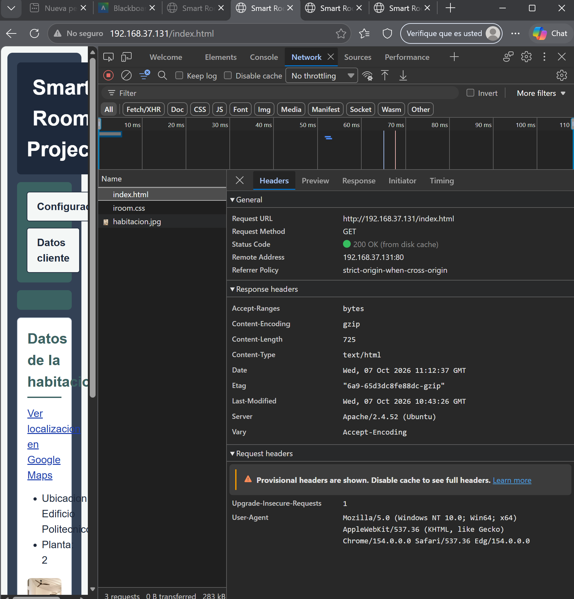
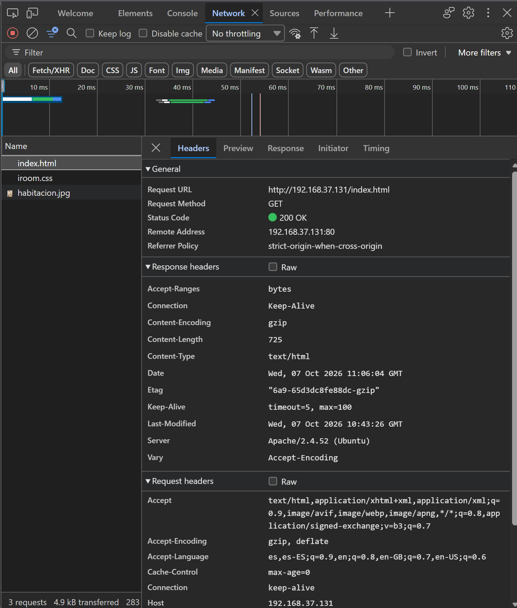
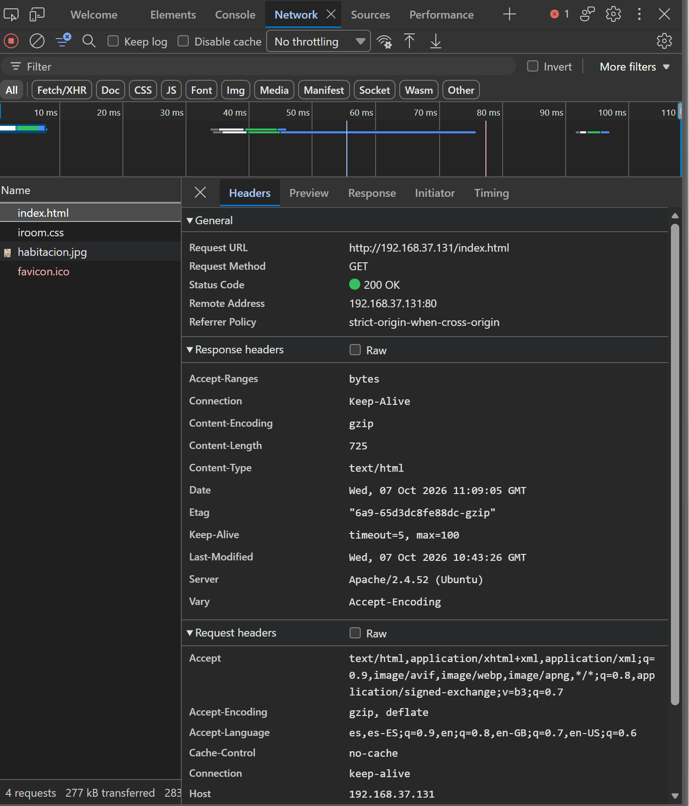

**Capturas (después):**

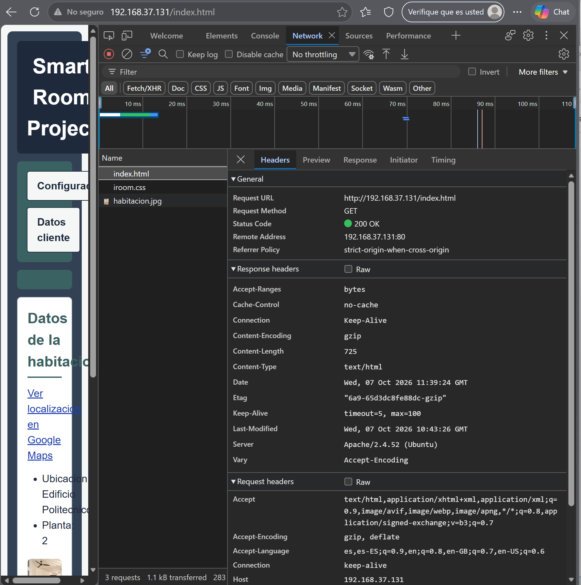
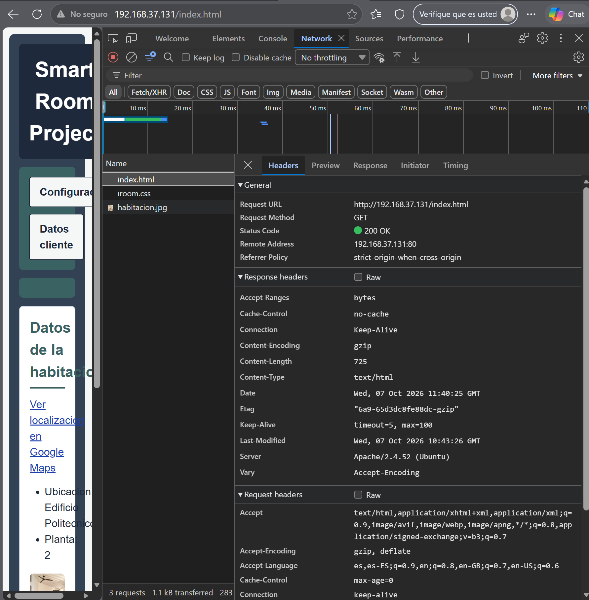
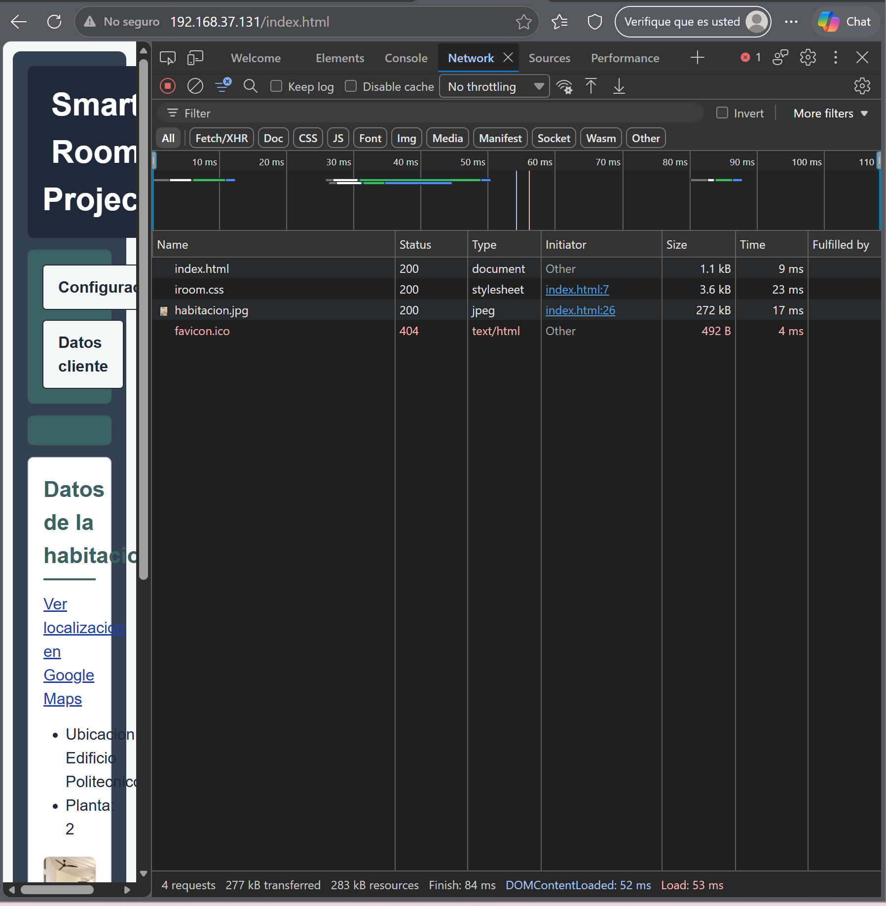

### 4.5 Recursos estáticos versionados

Para archivos como hojas de estilo (`.css`), scripts o imágenes, usar `no-cache` es menos eficiente: obliga a consultar al servidor en cada uso, aunque casi nunca cambien. Lo ideal es darles una caducidad larga con `max-age` y, cuando el archivo se actualiza, **cambiarle el nombre** (por ejemplo, `iroom.v2.css`), de modo que el navegador lo trate como un recurso nuevo. Esto se conoce como versionado de recursos y permite una política como `Cache-Control: public, max-age=31536000, immutable`, que evita preguntar al servidor.

En esta práctica los archivos no llevan versión en el nombre (`iroom.css`), por lo que una caducidad muy larga haría que los visitantes siguieran viendo estilos antiguos tras una actualización. Mientras no se versionen, conviene una caducidad corta o usar `no-cache`.

---

## Apartado 6: Actualización mediante eventos enviados por el servidor (SSE) — Opcional

Para que los datos de los sensores se actualicen sin que el usuario recargue la página, se propone una arquitectura basada en **Server-Sent Events (SSE)**: el navegador abre una única conexión HTTP con el servidor y este va enviando por ella los datos nuevos. La comunicación es unidireccional (del servidor al cliente), que es justo lo que necesita un panel de sensores. Frente al *polling*, evita peticiones repetidas que a menudo no traen nada nuevo, y frente a WebSocket es más sencillo porque funciona sobre HTTP normal y el navegador se reconecta solo.

**Arquitectura.** El servidor expone un recurso (por ejemplo, `/api/sensores/stream`), atendido por un script del servidor (PHP, Python, Node...), porque un servidor de archivos estáticos no puede mantener la conexión abierta ni generar eventos. El script responde con las cabeceras:

```
Content-Type: text/event-stream
Cache-Control: no-cache
Connection: keep-alive
```

**Formato de los mensajes `text/event-stream`.** Es texto plano. Cada mensaje está formado por líneas del tipo `campo: valor` y termina con una **línea en blanco**. Los campos habituales son `data` (el contenido, obligatorio), `event` (nombre del evento; si no se indica, es `message`), `id` (identificador, que el navegador reenvía al reconectar) y `retry` (milisegundos de espera para reconectar). Las líneas que empiezan por `:` son comentarios.

```
event: sensores
id: 42
data: {"temperatura": 22.5, "humedad": 41}

```

**Conexión desde el navegador con `EventSource`:**

```javascript
const fuente = new EventSource("/api/sensores/stream");

fuente.addEventListener("sensores", (evento) => {
    const datos = JSON.parse(evento.data);
    document.getElementById("valor-temperatura").textContent = datos.temperatura + "ºC";
});

fuente.onerror = () => {
    console.log("Conexión perdida; el navegador reintentará automáticamente.");
};
```

**Procedimiento de actualización de la interfaz.** Cada vez que el servidor detecta una medida nueva, escribe un mensaje en la conexión abierta. El navegador lo recibe, dispara el manejador del evento y el código JavaScript modifica el DOM: en este caso, el contenido de la celda de la tabla de sensores, a la que se le asignaría un `id` (por ejemplo, `valor-temperatura`). Si la conexión se cae, `EventSource` reintenta de forma automática y envía la cabecera `Last-Event-ID` para que el servidor pueda retomar desde el último evento recibido.

---

## Apartado 8: Mejoras adicionales (opcional)

Se han añadido seis mejoras que no se pedían en los apartados anteriores. Todas están en los mismos archivos de la práctica (no hay librerías externas) y no han introducido errores en la validación del Apartado 9.

| Mejora | Dónde | Qué hace y por qué |
| :--- | :--- | :--- |
| **Favicon propio** | `images/favicon.svg` y `<link rel="icon">` en las tres páginas | Muestra un icono en la pestaña y evita la petición fallida a `/favicon.ico` (error 404) que aparecía en la pestaña Red. Es un SVG, así que pesa muy poco y se ve nítido a cualquier tamaño. |
| **Modo oscuro automático** | `iroom.css`, bloque `@media (prefers-color-scheme: dark)` | Si el sistema del usuario está en modo oscuro, la web usa una paleta oscura. Como todos los colores del CSS son variables (`var(--...)`), solo se redefinen las variables en `:root`, sin tocar el resto de reglas. Se comprobó el contraste de texto, enlaces y campos. |
| **Enlace "Saltar al contenido"** | `<a class="saltar">` en las tres páginas y reglas `.saltar` | Es el primer elemento al que llega la tecla Tab y solo se ve al recibir el foco. Permite a quien navega con teclado o con lector de pantalla saltarse el título y el menú. Complementa el foco visible que pide el Apartado 1. |
| **Transiciones y animación CSS** | `iroom.css`, `transition`, `transform` y `@keyframes aparecer` | Los cambios de color de enlaces, botones y campos duran 0,25 s en vez de ser bruscos, los botones suben 2 px al pasar el ratón y la página aparece con un fundido al cargar. Con `prefers-reduced-motion: reduce` todo esto se desactiva, por accesibilidad. |
| **Vista previa de la foto** | `config.html`, script del final | Al elegir un archivo en el campo «Foto», el evento `change` crea un elemento `` con `URL.createObjectURL`, de modo que se ve la imagen antes de enviar el formulario. Solo muestra archivos de tipo imagen y la imagen lleva atributo `alt`. Además, el campo usa `accept="image/*"`. |
| **Estilos de impresión** | `iroom.css`, bloque `@media print` | Al imprimir o guardar como PDF se quitan los fondos, el menú, la zona de información y el botón de enviar, y tras cada enlace externo se escribe su dirección, porque en papel no se puede hacer clic. |

**Variables nuevas.** Para que el modo oscuro funcione sin duplicar reglas, los colores que antes estaban escritos directamente en algunas reglas (fondo de los campos, de la cabecera de la tabla, del resultado, de los campos no válidos, color de los subtítulos y del hover de los enlaces) pasaron a variables: `--campo-fondo`, `--cabecera-tabla`, `--salida-fondo`, `--error-fondo`, `--subtitulo` y `--enlace-hover`. En modo claro tienen los mismos valores de antes, así que el aspecto no cambia.

---

## Apartado 9: Validación y calidad del código

Se han utilizado las herramientas oficiales del W3C para validar el HTML (W3C Nu Html Checker, en `validator.w3.org`) y la hoja de estilos (W3C CSS Validation Service, en `jigsaw.w3.org/css-validator`), y la consola de las herramientas de desarrollo del navegador para comprobar que no aparecen errores. La siguiente tabla recoge las herramientas utilizadas, los problemas identificados y las correcciones aplicadas.

| Herramienta | Archivo | Resultado / problema identificado | Corrección aplicada |
| :--- | :--- | :--- | :--- |
| **W3C Nu Html Checker** | index.html (versión original) | Dos avisos: *Warning: Section lacks heading* en `<section id="habitacion">` (línea 18) y en `<section id="sensores">` (línea 26). El estándar recomienda identificar con un encabezado `h2`–`h6` el contenido de cada `<section>`. | Se añadió un `<h2>` en las secciones «Datos de la habitación» y «Datos de los sensores». |
| **W3C Nu Html Checker** | index.html (versión final) | Sin errores ni avisos. | — |
| **W3C Nu Html Checker** | config.html (versión final) | Sin errores ni avisos. | — |
| **W3C Nu Html Checker** | minombre.html (versión final) | Sin errores ni avisos. | — |
| **W3C Nu Html Checker** (comprobador de CSS integrado) | css/iroom.css (versión anterior) | Rechazó la propiedad `text-decoration-thickness` en la regla `a:hover` (línea 75), aunque el W3C CSS Validation Service la daba por válida. Cada herramienta usa su propio motor de CSS y no aceptan exactamente las mismas propiedades. | Se sustituyó por un cambio de color en el estado hover: `a:hover { color: var(--enlace-hover); }`, una variable de color definida al principio del CSS. Así el archivo pasa en las dos herramientas. |
| **W3C CSS Validation Service** | css/iroom.css (tras añadir las mejoras del Apartado 8) | Una advertencia (no un error): la propiedad `animation` no existe en el medio `print` (línea 517). Venía de `animation: none;` dentro de `@media print`. | Se quitó esa línea, porque en papel no hay animación que desactivar. Tras el cambio, el validador indica «No error encontrado» y ya no muestra advertencias. |
| **W3C CSS Validation Service** | css/iroom.css (versión final) | Sin errores (CSS nivel 3 + SVG). | — |
| **Consola de Microsoft Edge (DevTools)** | index.html | Al abrir la página como archivo local aparecía el mensaje *«Unsafe attempt to load URL file:///... from frame with URL file:///...»*. | El mensaje desaparece al abrir la página en una ventana InPrivate, sin extensiones, por lo que no procede del código de la práctica. Con ese método, las consolas de las tres páginas aparecen sin errores («No issues»). |

### Capturas de validación

**index.html (avisos originales):**
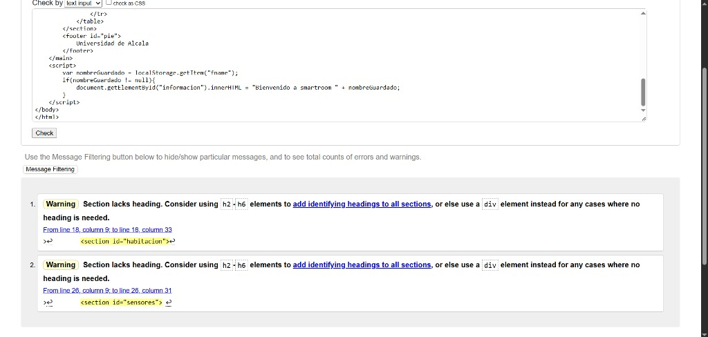

**index.html (validación final):**
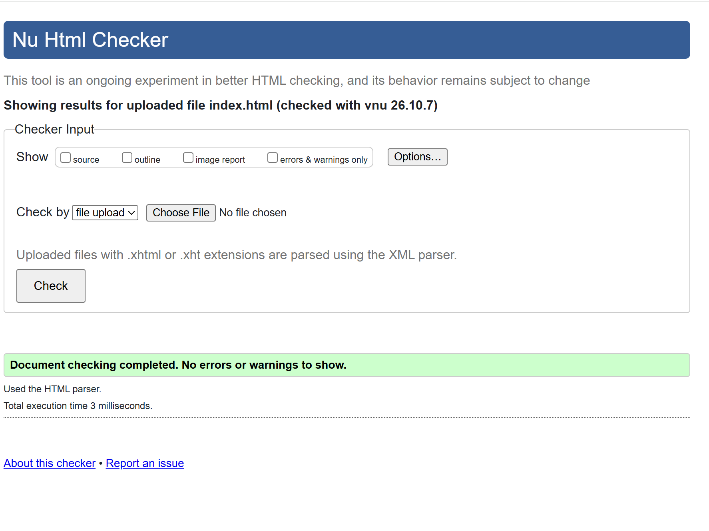

**config.html (validación final):**
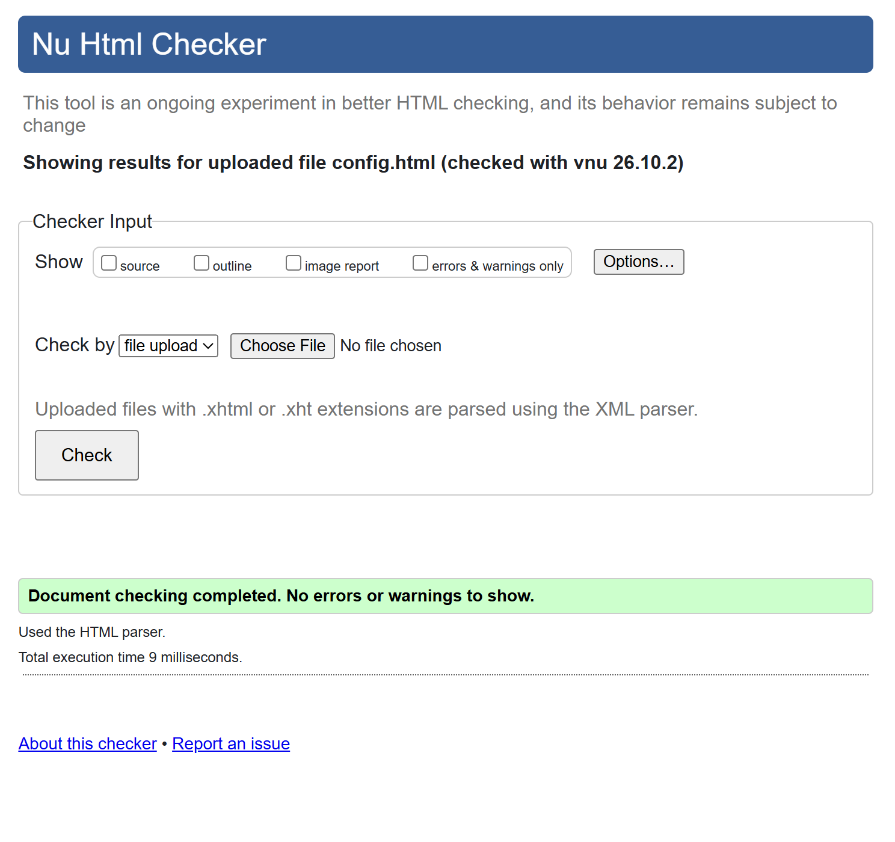

**minombre.html (validación final):**
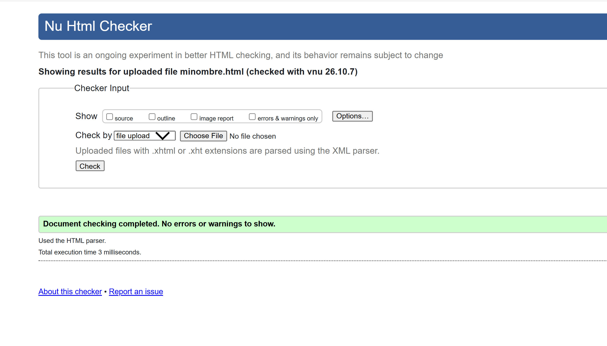

**iroom.css (validación final):**
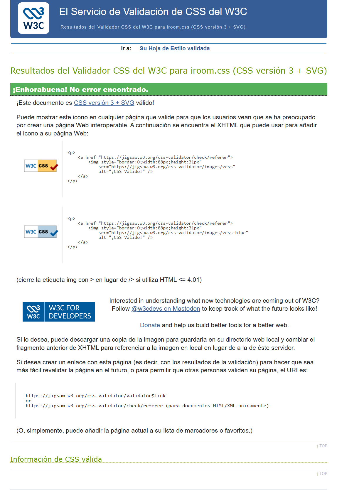

### Capturas de la consola del navegador

**index.html:**
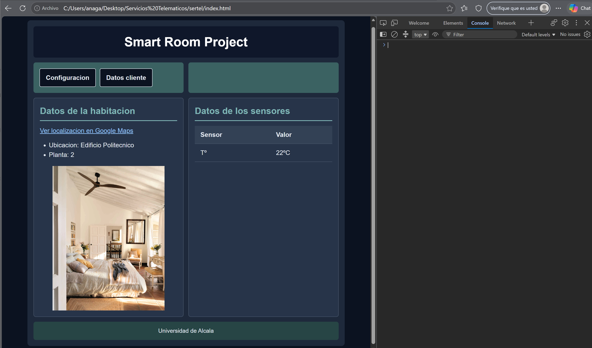

**config.html:**
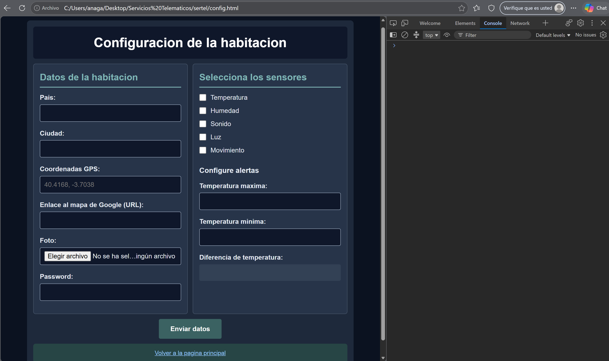

**minombre.html:**
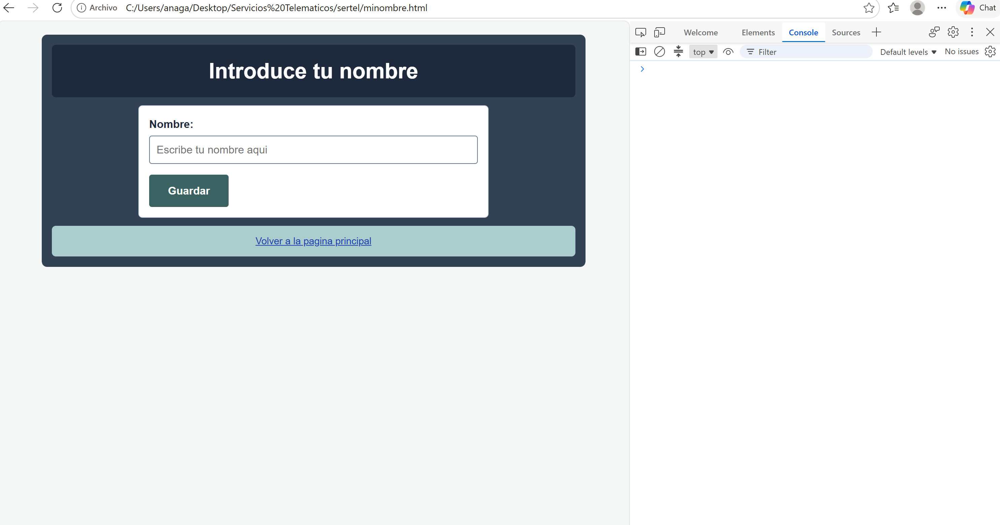
