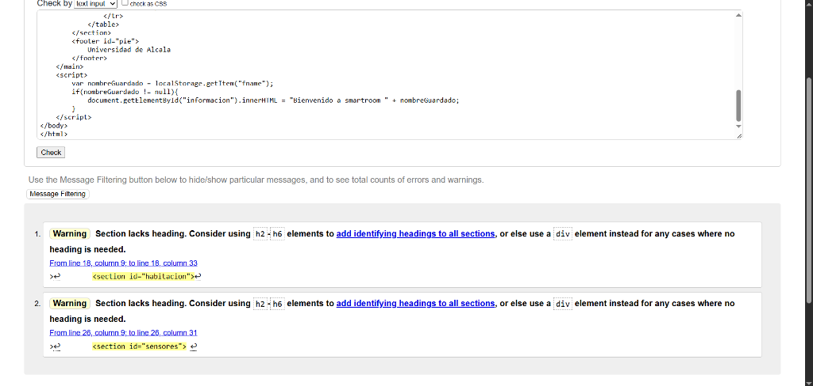
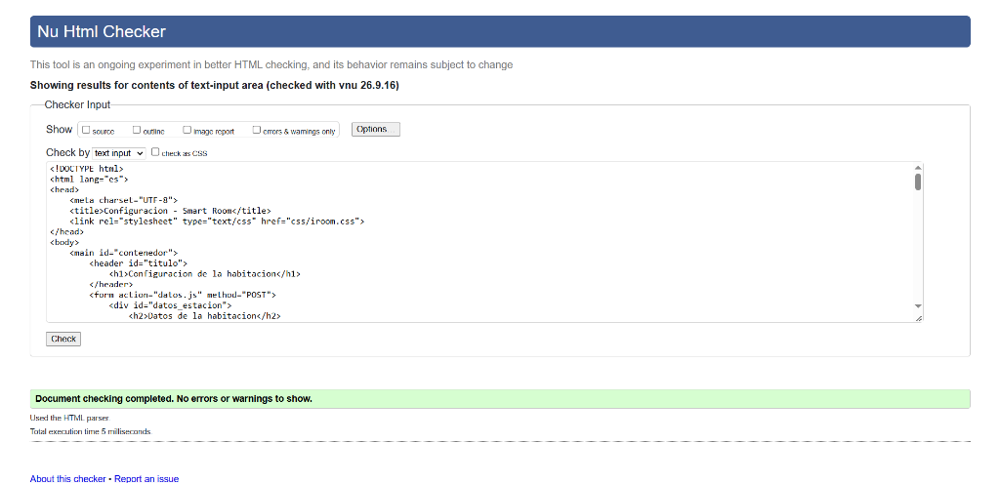
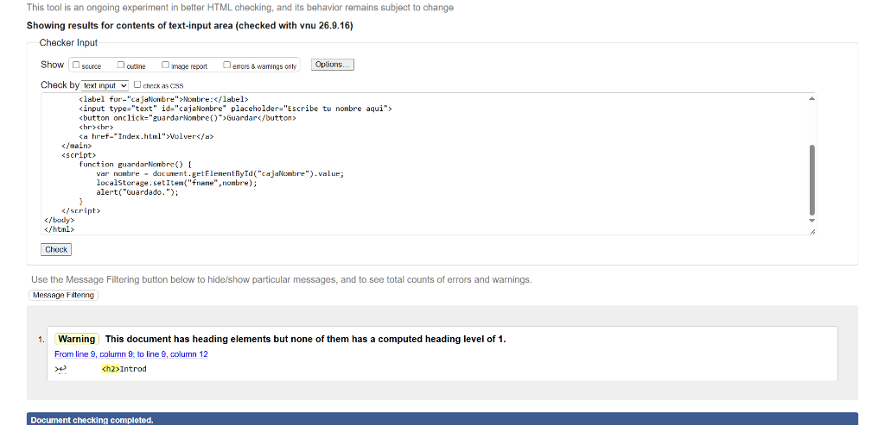
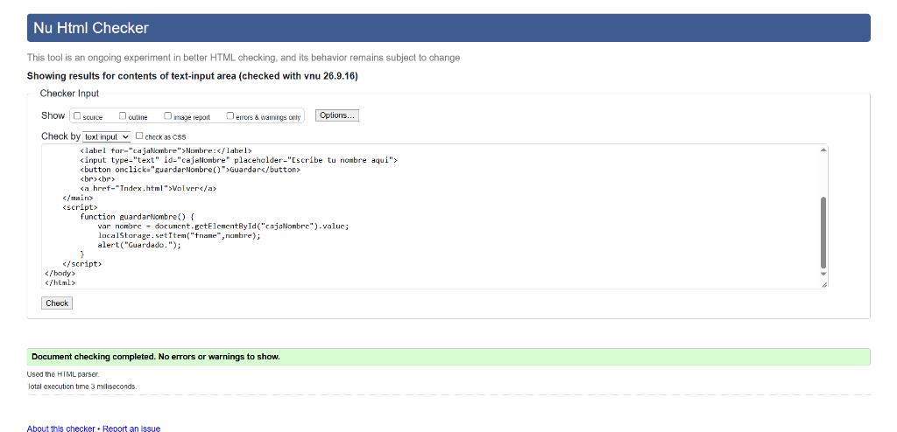

# Memoria de Prácticas: Desarrollo Web (HTML5 y CSS3)

## Apartado 2: Validación de la Temperatura
Para garantizar que la temperatura máxima introducida en el formulario sea mayor o igual que la mínima, se ha utilizado la API de validación nativa de HTML5 mediante JavaScript (setCustomValidity()).

Se ha implementado un script que, mediante el evento input, lee en tiempo real los valores de los campos de temperatura. Si el valor máximo es inferior al mínimo, se ejecuta inputMax.setCustomValidity("La temperatura máxima debe ser mayor o igual a la mínima"), bloqueando el envío del formulario y mostrando un aviso nativo del navegador. Si los valores son correctos, el mensaje se limpia y se calcula la diferencia en la etiqueta <output>.

*Nota:* Esta es una validación del lado del cliente orientada a mejorar la experiencia de usuario (UX). Por seguridad, siempre debe complementarse con una validación en el lado del servidor.

## Apartado 4: Control de Caché (Cabeceras HTTP)
Se ha procedido a analizar la gestión de la caché en los recursos de la web estudiando las cabeceras HTTP de respuesta:

- **no-cache**: Esta directiva permite que el navegador almacene el recurso en su memoria caché local, pero le obliga a validar siempre con el servidor (mediante validadores como ETag o Last-Modified) si el archivo ha sufrido modificaciones. Si no ha cambiado, usa el guardado; si cambió, lo descarga de nuevo.
- **no-store**: Es la directiva más restrictiva. Prohíbe totalmente al navegador guardar el recurso en el disco duro o en caché bajo ninguna circunstancia. Es útil para páginas que manejan datos confidenciales o bancarios.

**Justificación para recursos estáticos versionados:** Para archivos como hojas de estilo (.css), imágenes o scripts, usar 
o-cache es menos eficiente. Lo ideal es utilizar un tiempo de caché largo (max-age) y, cuando se actualiza el archivo, cambiarle el nombre (ej. estilo_v2.css). Esto se conoce como "versionado de recursos" y evita tener que consultar al servidor constantemente si el archivo ha cambiado.

## Apartado 6: Actualización mediante eventos SSE (Opcional)
Para lograr que los datos de los sensores de la habitación se actualicen automáticamente sin que el cliente tenga que recargar la página, se propone una arquitectura basada en **Server-Sent Events (SSE)**. 

El servidor expondría un endpoint (por ejemplo, /api/sensores/stream) que devuelve cabeceras HTTP específicas (Content-Type: text/event-stream). Por su parte, el navegador web usaría el objeto JavaScript EventSource para conectarse a ese endpoint y mantener una conexión unidireccional abierta de forma permanente. Cada vez que el servidor detecta una nueva medida en un sensor, empuja un evento de texto al cliente y el JavaScript actualiza dinámicamente el DOM (la tabla de sensores) mediante manejadores como onmessage.

## Apartado 9: Validación y calidad del código
Se han utilizado las herramientas oficiales del W3C para validar la sintaxis del código de la práctica. A continuación, se detalla la tabla con las herramientas utilizadas, los problemas encontrados y las correcciones aplicadas:

| Herramienta | Archivo | Problema / Advertencia identificada | Solución aplicada |
| :--- | :--- | :--- | :--- |
| **W3C Nu Html Checker** | Index.html | *Warning: Section lacks heading.* El estándar recomienda incluir elementos h2-h6 para identificar el contenido de las etiquetas <section>. | Se ha añadido un encabezado <h2> dentro de las secciones de "Datos de la habitación" y "Datos de los sensores" para aportar una jerarquía coherente. |
| **W3C Nu Html Checker** | config.html | *Error: The heading h3 follows the heading h1, skipping 1 heading level.* Salto en la jerarquía de encabezados. | Se han reemplazado las sub-secciones que usaban <h3> por <h2> para mantener la progresión semántica lógica que requiere HTML5 tras el <h1> principal. |
| **W3C Nu Html Checker** | \minombre.html\ | *Warning: This document has heading elements but none of them has a computed heading level of 1.* Falta el encabezado principal de la pagina. | Se ha cambiado la etiqueta \<h2>\ por un \<h1>\ para cumplir con las reglas de accesibilidad que exigen un titulo principal por documento. |

### Capturas de Validacion

**Index.html (Advertencia original):**

**config.html (Validacion superada):**

**minombre.html (Advertencia original):**

**minombre.html (Validacion superada tras corregir el h1):**

